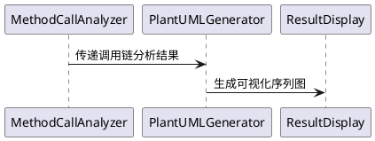

# 项目架构说明

## 二、项目结构
项目采用典型的 Gradle 项目结构，各主要目录和文件的功能如下：

```
.idea-puml-plugin/
├── build.gradle.kts    # 项目构建脚本（Kotlin DSL）
├── src/
│   └── main/
│       ├── java/      # 插件核心Java源码
│       └── resources/ # 资源文件
│           └── META-INF/
│               └── plugin.xml  # 插件元数据配置
└── build/             # 构建输出目录
    ├── libs/         # 生成的插件jar包
    └── reports/      # 构建报告

```

## 三、构建配置
### 1. 插件应用
```kotlin
plugins {
    id("java")
    id("org.jetbrains.intellij") version "1.17.2"
}
```
- `java` 插件：支持Java项目构建
- `org.jetbrains.intellij` 插件：专用于IntelliJ插件开发

### 2. 仓库配置
```kotlin
repositories {
    maven("https://maven.aliyun.com/repository/public")
    maven("https://www.jetbrains.com/intellij-repository/releases")
}
```

### 3. IDE配置
```kotlin
intellij {
    version.set("2024.3.4")
    type.set("IC")  # Community Edition
    plugins.add("com.intellij.java")
}
```

### 4. 任务配置
```kotlin
tasks {
    wrapper {
        gradleVersion = "8.10"  # 与build.gradle.kts配置一致
    }
    buildSearchableOptions {
        enabled = false
    }
}
```

## 四、核心功能模块

1. **MethodCallAnalyzer**：方法调用链分析器
2. **PlantUMLGenerator**：PlantUML代码生成器
3. **ResultDisplay**：结果展示对话框