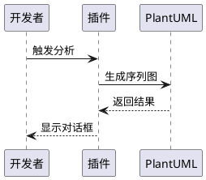

# 使用指南

## 五、使用方法
### 1. 构建和运行插件
在 IntelliJ IDEA 中，打开项目的 build.gradle.kts 文件，运行 gradle runIde 任务，这将启动一个新的 IntelliJ IDEA 实例（沙盒环境），并加载该插件。

### 2. 触发插件功能
1. 打开一个 Java 项目和相应的 Java 文件
2. 将光标定位到想要分析的方法内部，或者选中该方法的代码块
3. 点击菜单栏中的 Tools -> Generate Call Sequence
4. 插件将开始分析方法调用链，并生成 PlantUML 代码
5. 生成的 PlantUML 代码将显示在一个对话框中

## 六、注意事项
- 确保使用的 IntelliJ IDEA 版本与 build.gradle.kts 中配置的版本兼容
- 若项目依赖特定的库，需确保这些库在配置的 Maven 仓库中可获取
- 建议使用Gradle 8.10版本构建（与wrapper配置一致）

## 七、未来展望
- 支持更多的编程语言（Kotlin、Python等）
- 优化PlantUML代码生成逻辑
- 增加序列图样式自定义功能
- 支持导出为SVG/PNG格式